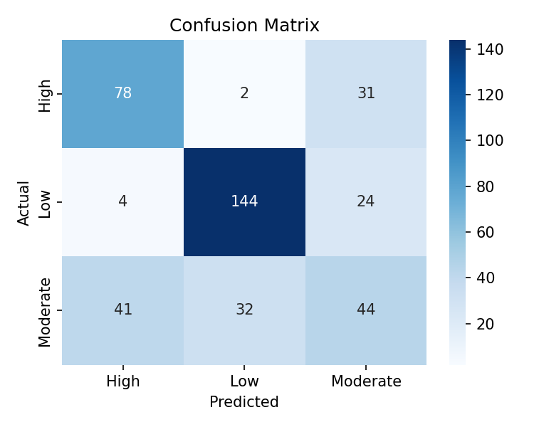
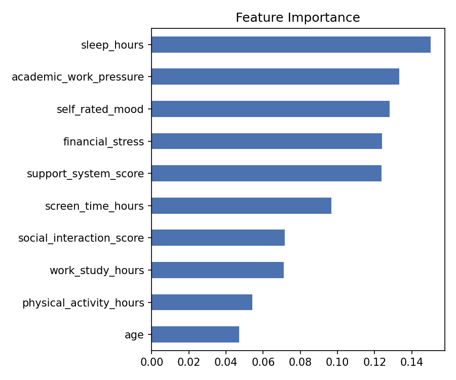

# 🧠 AI-Based Mental Health Monitoring Solution

An academic machine-learning project that estimates a general **wellbeing / stress
risk level** (Low, Moderate, High) from everyday lifestyle factors — sleep,
screen time, physical activity, social interaction, workload, and self-rated
mood — using a **Random Forest classifier**, served through a simple **Flask**
web app.

> ⚠️ **Disclaimer:** This is a student project built for a Generative AI
> course. It is **not** a medical device, does **not** diagnose any mental
> health condition, and must not be used as a substitute for professional
> help. If you or someone you know is struggling, please reach out to a
> licensed mental health professional or a local helpline.

---

## 📋 Table of Contents

- [Project Overview](#-project-overview)
- [Tech Stack](#-tech-stack)
- [Project Structure](#-project-structure)
- [How It Works](#-how-it-works)
- [Setup & Installation](#-setup--installation)
- [How to Run](#-how-to-run)
- [Sample Results](#-sample-results)
- [Dataset Notes](#-dataset-notes)
- [Future Improvements](#-future-improvements)
- [License](#-license)

---

## 📖 Project Overview

Users answer a short lifestyle check-in form (10 questions). The trained
model predicts a risk category and the app shows:

- The predicted risk level (**Low / Moderate / High**)
- The model's confidence for each class
- General, non-clinical self-care suggestions based on the result

The goal of this project is to demonstrate an end-to-end applied ML
workflow: synthetic data generation → preprocessing → model training →
evaluation → deployment behind a simple web UI.

---

## 🛠 Tech Stack

| Layer            | Technology                          |
|-------------------|--------------------------------------|
| Language          | Python 3.10+                        |
| ML / Data         | scikit-learn, pandas, numpy         |
| Model             | Random Forest Classifier            |
| Visualization     | matplotlib, seaborn                 |
| Web Framework     | Flask                               |
| Frontend          | HTML5, CSS3 (Jinja2 templates)      |
| Model persistence | joblib                              |

---

## 📁 Project Structure

```
mental-health-monitoring/
├── app.py                     # Flask application (routes + prediction logic)
├── requirements.txt           # Python dependencies
├── data/
│   └── generate_dataset.py    # Creates the synthetic survey dataset
├── model/
│   └── train_model.py         # Trains & evaluates the Random Forest model
├── templates/
│   ├── base.html
│   ├── index.html             # Check-in form
│   └── result.html            # Prediction result page
├── static/
│   └── style.css
├── docs/                       # Sample plots for this README
│   ├── confusion_matrix.png
│   ├── feature_importance.png
│   └── sample_metrics.txt
└── README.md
```

`data/survey_data.csv` and the trained artifacts in `model/` (`model.pkl`,
`scaler.pkl`, `label_encoder.pkl`, plots) are **generated locally** by the
scripts below and are not committed to the repo — this keeps the repo small
and fully reproducible.

---

## ⚙️ How It Works

1. **`data/generate_dataset.py`** creates a synthetic but statistically
   realistic dataset of 2,000 survey responses. Real clinical mental-health
   datasets typically require data-use agreements, so a transparent,
   rule-based synthetic generator is used instead — this keeps the project
   100% reproducible and ethically shareable. Swap in a real, licensed
   dataset here if you have one.
2. **`model/train_model.py`** splits the data, scales features with
   `StandardScaler`, trains a `RandomForestClassifier` (300 trees, balanced
   class weights), and saves the model, scaler, label encoder, a confusion
   matrix, and a feature-importance chart.
3. **`app.py`** loads the saved model and serves a form. On submit, it scales
   the input the same way as training, predicts a risk class and
   probabilities, and renders a result page with suggestions.

---

## 💻 Setup & Installation

### Prerequisites
- Python 3.10 or higher
- `pip`

### 1. Clone the repository
```bash
git clone https://github.com/Shalini2825/mental-health-monitoring.git
cd mental-health-monitoring
```

### 2. Create a virtual environment (recommended)
```bash
python -m venv venv
source venv/bin/activate        # On Windows: venv\Scripts\activate
```

### 3. Install dependencies
```bash
pip install -r requirements.txt
```

---

## ▶️ How to Run

Run these three commands in order, from the project root:

```bash
# 1. Generate the synthetic dataset
python data/generate_dataset.py

# 2. Train the model (creates model/model.pkl, scaler.pkl, label_encoder.pkl)
python model/train_model.py

# 3. Start the web app
python app.py
```

Then open **http://127.0.0.1:5000** in your browser, fill in the check-in
form, and click **"Check my wellbeing"** to see your predicted risk level.

---

## 📊 Sample Results

On a held-out 20% test split, the model achieves roughly **65–70% accuracy**
across three balanced classes (Low / Moderate / High) — reasonable for a
3-class problem trained on synthetic data with intentional noise.

**Confusion Matrix**



**Feature Importance**



Full metrics are saved to `model/metrics.txt` after training (a sample is
kept at `docs/sample_metrics.txt`).

---

## 🗂 Dataset Notes

The dataset is synthetically generated with `numpy`, using a transparent
weighted formula over 10 lifestyle features (sleep, screen time, exercise,
social interaction, workload, mood, academic/work pressure, financial
stress, and support system strength) plus random noise, then binned into
Low / Moderate / High risk. This is a **heuristic, not a validated clinical
instrument** — it exists so the project can be trained and demoed without
requiring access to restricted real-world health data.

---

## 🚀 Future Improvements

- Swap in a real, licensed mental-health survey dataset (e.g. a validated
  DASS-21 / PHQ-9-based dataset) with proper ethical approval
- Add user accounts and a historical mood-tracking dashboard
- Experiment with additional models (XGBoost, logistic regression baseline)
  and hyperparameter tuning
- Add unit tests and CI (GitHub Actions)
- Deploy to a cloud host (Render, Railway, PythonAnywhere)

---

## 📄 License

This project is released under the [MIT License](LICENSE).

---

*Built as part of a Generative AI course project.*
